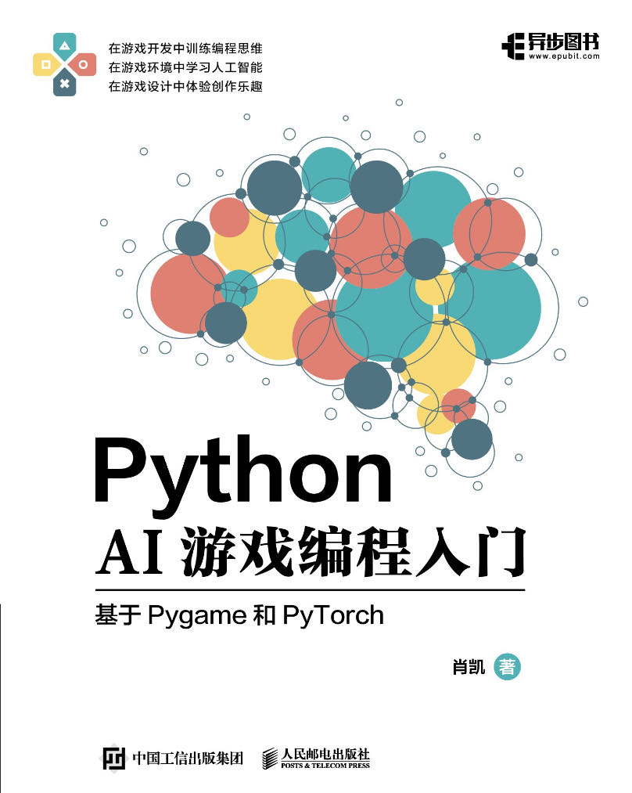

# Python_AI_Game

## 为什么写这本书
游戏是人类文明的基本组成部分。它不仅是代码与逻辑的组合，更是情感与故事的交织；它连接着过去的经验与未来的想象。为了让更多人可以成为游戏世界的创造者。我写了一本小书📚《Python AI游戏编程入门》。它将带你从零开始，学习如何创作自己的游戏，并通过AI算法赋予其生命。

## 简介
未来属于代码与人工智能的融合。掌握这两项技能无疑是通往数字时代的桥梁。对很多人来说，编程可能显得抽象且乏味，但游戏却是激发人类兴趣与创造力的天然媒介。本书旨在通过创建一系列趣味盎然的小游戏来教授Python编程，并将人工智能技术融入其中，使学习过程变得既生动又具象，成就显著且可见。我们采用游戏、编程与人工智能相结合的方式，三者互为补充，共同提升学习体验。我们更希望通过这种方式，让读者能够领略编码世界的无限魅力。本书不仅适合青少年编程教育，同时也推荐给所有对游戏AI开发抱有热情的学习者。

## 目录
### 第一部分：基础篇

1. 编程、游戏和AI
2. Python环境准备 
3. Pygame基础知识

### 第二部分：Python游戏编程 

4. 贪吃蛇游戏编程
5. 打砖块游戏编程
6. 笨鸟先飞游戏编程
7. 五子棋游戏编程

### 第三部分：人工智能基础

8. 神经网络和PyTorch
9. 蒙特卡洛模拟
10. 强化学习入门  
11. 深度强化学习算法DQN
12. 遗传算法 

### 第四部分：游戏AI项目实践

13.  贪吃蛇游戏AI编程（基于深度强化学习）
14.  打砖块游戏AI编程（基于深度强化学习）
15.  笨鸟先飞游戏AI编程（基于深度强化学习和遗传算法）
16.  五子棋游戏AI编程（基于蒙特卡洛树搜索）

